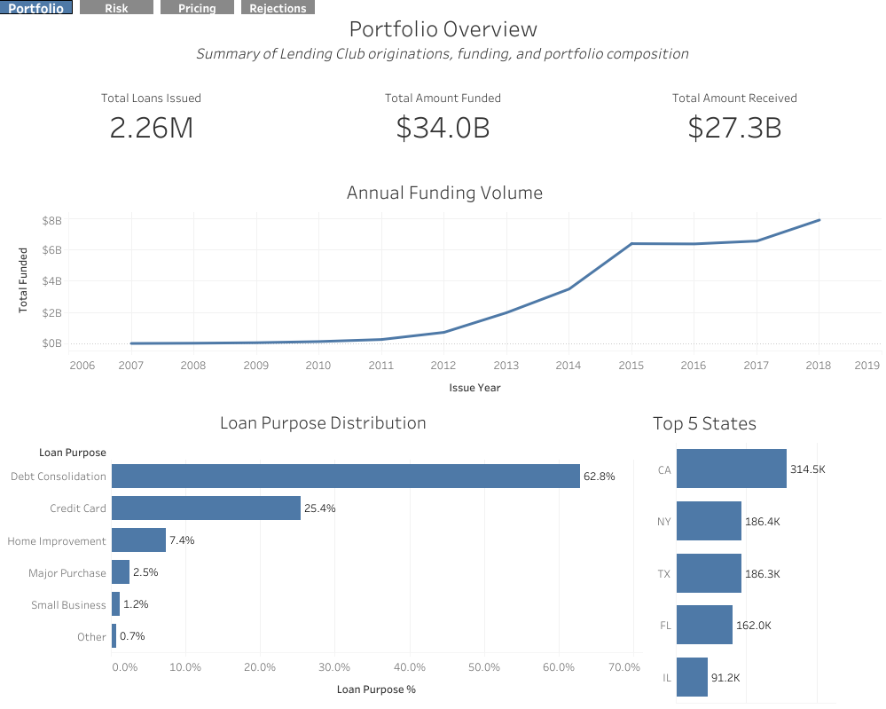
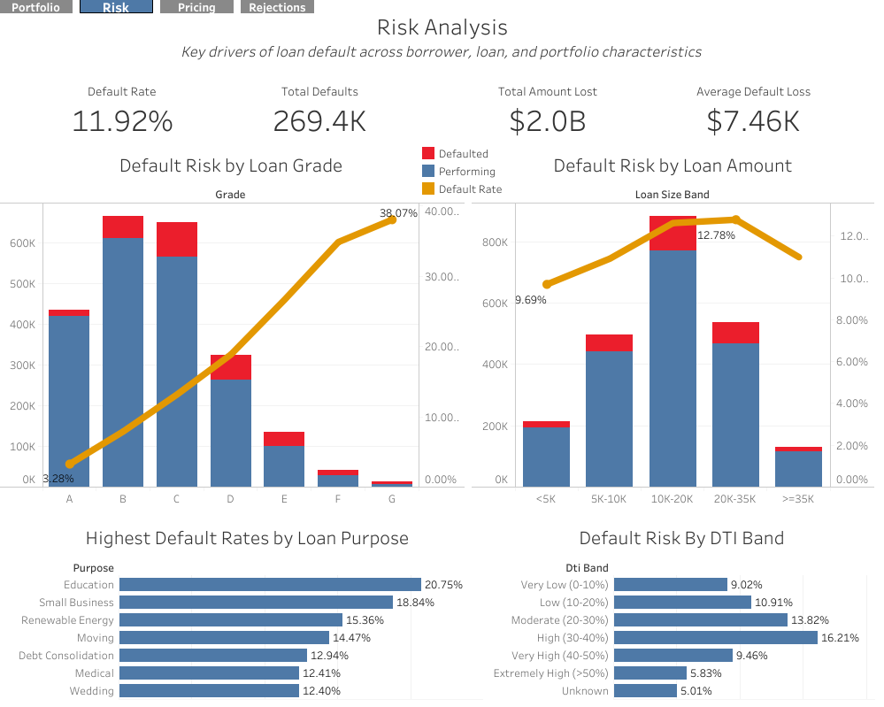
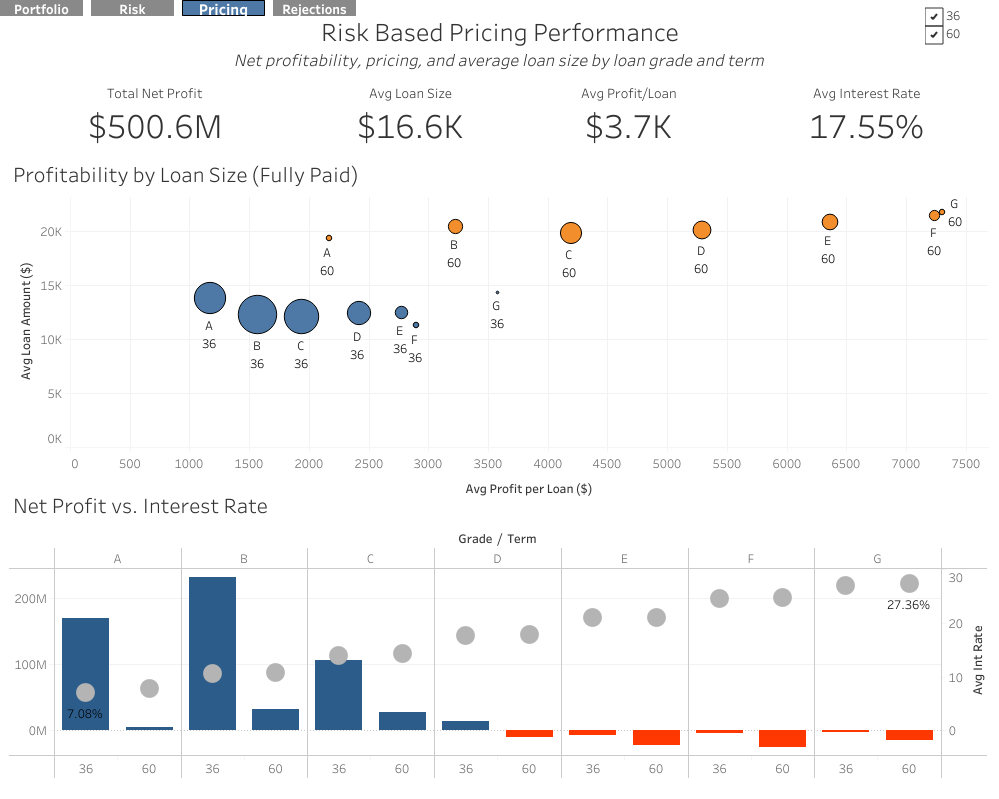
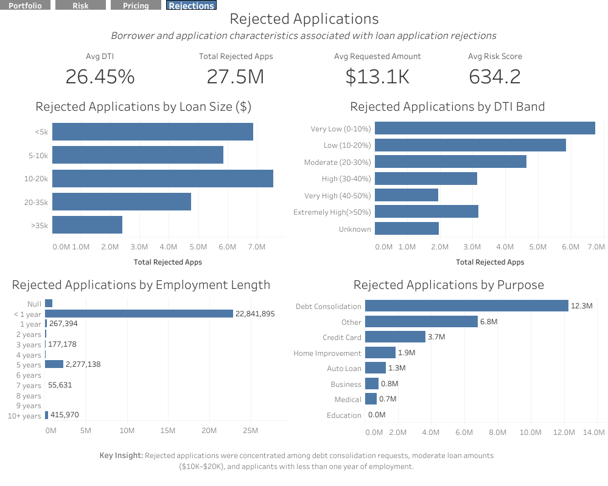

# Loan Portfolio Performance & Risk Analysis

## Overview

This project analyzes over 2.6 million Lending Club loan records to evaluate portfolio performance, identify credit risk factors, assess pricing strategy effectiveness, and examine rejected loan applications.

The analysis was completed using **Google BigQuery**, **SQL**, and **Tableau**, with GitHub as the documentation and version control platform.

The goal is to demonstrate an end-to-end analytics workflow, from raw data cleaning through dashboard development, while providing actionable business recommendations that could support lending decisions.

---

## Business Problem

Financial institutions must balance profitability with risk when issuing loans.

This project explores questions such as:

- Which loan grades generate the highest profit?
- Which borrower characteristics contribute most to default?
- Are interest rates appropriately aligned with portfolio risk?
- What patterns exist among rejected loan applications?
- How can portfolio performance be improved while controlling credit risk?

---

## Project Objectives

- Clean and validate Lending Club loan data using SQL
- Create analysis-ready summary tables using SQL
- Design executive-level Tableau dashboards
- Identify key drivers of profitability and default
- Develop business recommendations supported by data

---

## Dataset

**Source:** Lending Club Loan Data

The project analyzes both:

- **Accepted Loan Applications**
- **Rejected Loan Applications**

Rather than directly joining these datasets, they are analyzed independently using shared metrics such as:

- Loan Amount
- Debt-to-Income Ratio (DTI)
- Employment Length
- Purpose

---

## Tools Used

| Tool | Purpose |
|------|---------|
| Google BigQuery | Data storage and SQL analysis |
| SQL | Data cleaning, feature engineering, aggregation |
| Tableau Public | Dashboard development |
| GitHub | Documentation and version control |

---

# Dashboard Structure

## 1. Executive Portfolio Overview

Provides a high-level summary of the portfolio including:

- Total Loans Issued
- Total Funded Amount
- Total Payment Received
- Lending Growth Over Time
- Loan Purpose Distribution
- Geographic Distribution


---

## 2. Credit Risk & Performance

Evaluates factors associated with loan defaults.

Key analyses include:

- Overall Default Rate
- Total Portfolio Loss
- Default Rate by Loan Grade
- Default Rate by DTI
- Default Rate by Loan Amount
- Default Rate by Loan Purpose


---

## 3. Pricing Strategy

Examines whether loan pricing appropriately reflects portfolio risk.

Includes:

- Total Net Profit
- Average Profit by Loan Size (Fully Paid Only)
- Average Interest Rate by Grade/Term
- Net Profit by Grade/Term
- Net Profit vs Interest Rate


---

## 4. Rejected Applications

Analyzes characteristics of rejected loan requests.

Includes:

- Rejection Volume
- Average Requested Loan Amount
- Employment Length Distribution
- DTI Distribution
- Loan Purpose Distribution


---

# SQL Workflow

The project followed a structured SQL workflow:

1. Data Import
2. Data Cleaning
3. Data Validation
4. Feature Engineering
5. Summary Table Creation

Example feature engineering included:

- Income Bands
- DTI Bands
- Loan Size Groups
- Issue Year
- Net Profit Calculations
- Portfolio Loss Metrics

---

# Repository Structure

```
Loan-Portfolio-Performance-Risk-Analysis/
│
├── README.md
├── business_questions.md
├── sql/
│ ├── Cleaning/
│ ├── Feature_Engineering/
│ └── Analysis/
|
├── images/
  ├── Executive_Dashboard.png
  ├── Risk_Dashboard.png
  ├── Pricing_Dashboard.png
  └── Rejections_Dashboard.png
```

---

# Key Findings

- Higher-risk loan grades generated significantly higher default rates.
- Loan pricing generally increased with risk grade, although profitability varied substantially.
- Debt-to-Income ratio showed a meaningful relationship with loan performance.
- Certain loan purposes displayed higher default rates.
- Rejected applications displayed risk characteristics similar to the defaults observed in the accepted portfolio.

---

# Business Recommendations

Based on the analysis:

- Continue risk-based pricing while reviewing underperforming loan grades.
- Strengthen underwriting standards for high-risk borrower segments.
- Incorporate DTI more heavily into lending decisions.
- Monitor loan purposes associated with elevated default rates.
- Use rejected application trends to refine approval strategies and reduce future losses.

---

# Skills Demonstrated

- SQL
- Google BigQuery
- Data Cleaning
- Data Validation
- Feature Engineering
- Exploratory Data Analysis (EDA)
- Financial Analytics
- Credit Risk Analysis
- Portfolio Performance Analysis
- Data Visualization
- Tableau
- Dashboard Design
- Business Intelligence
- Git
- GitHub

---

# Tableau Dashboard

**Tableau Public:**

https://public.tableau.com/app/profile/alexander.kayser/viz/LendingClubPortfolioandRiskAnalysis/PortfolioOverview#1

---

# Project Architecture

```
Raw Lending Club Data
│
▼
Data Cleaning (SQL)
│
▼
Feature Engineering
│
▼
Summary Tables
│
▼
Tableau Dashboards
│
▼
Business Insights & Recommendations
```

---

# Author

**Alexander Kayser**

Aspiring Data Analyst with experience in lending operations, portfolio analysis, and business intelligence.

- GitHub: https://github.com/xkayser1997
- LinkedIn: https://linkedin.com/in/alexander-kayser-82a51b420/

